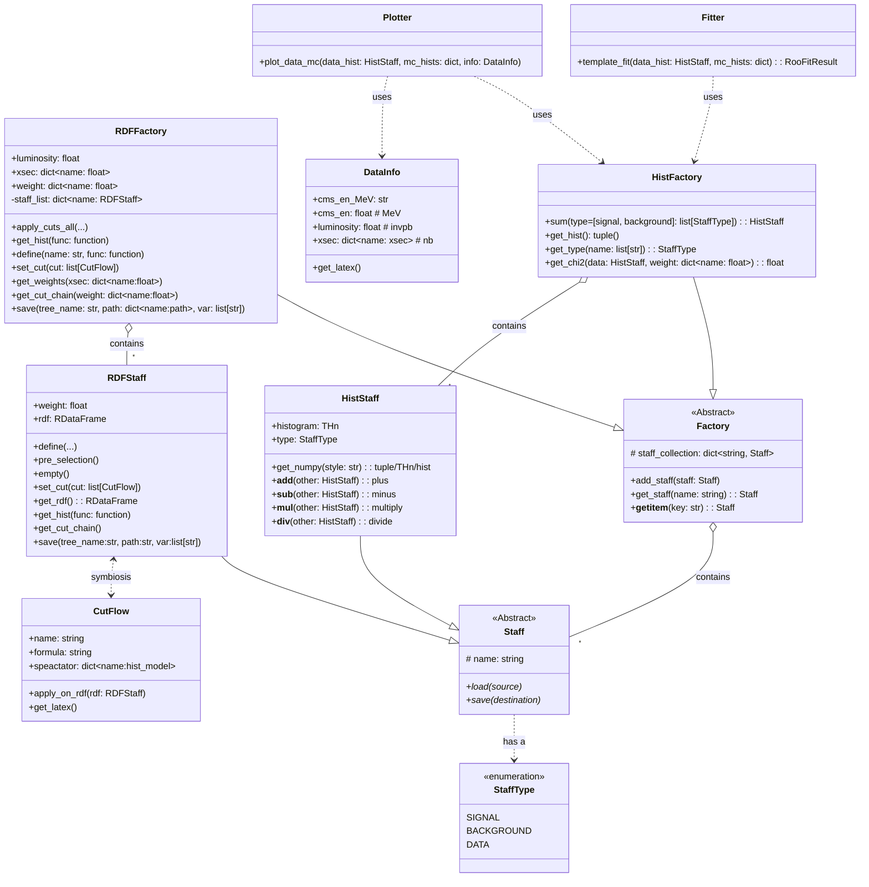

# DataFactory: 高能物理数据分析框架

以下是 AI 生成的临时文档。

DataFactory 是一个简单的 Python 框架，为高能物理（HEP）中的数据-蒙特卡洛（MC）分析而设计。该框架基于 `ROOT::RDataFrame` 构建，提供了一套工具，用于事例筛选、统计分析和数据可视化。

## 功能特点

- 统一管理数据和多个 MC 样本
- 基于 `ROOT::RDataFrame` 的高效数据处理
- 灵活的 cut flow 管理
- 直方图生成与操作
- 数据与 MC 样本的比较与可视化
- 统计分析工具

## 安装

1. 确保您已安装 Python 3.6+ 和 ROOT（带有 PyROOT 支持）。
2. 目前该工具仍在边用边开发的过程中，采用 Editable Mode 安装。
```bash
# 克隆仓库
git clone https://github.com/yourusername/datafactory.git
cd datafactory

# 安装依赖
conda activate <your_env>
pip install -e .
```

## 项目结构

DataFactory 由以下主要组件组成：

- **核心组件 (core.py)**：定义了框架的基础抽象类和数据结构
  - `Staff`：表示单个数据或 MC 样本的抽象基类
  - `Factory`：管理一组 Staff 样本的抽象基类
  - `StaffType`：标记直方图类型的枚举（信号、背景或数据）
  - `DataInfo`：存储数据的基本信息（CMS 能量、亮度等）

- **RDataFrame 实现 (rdf.py)**：提供 ROOT RDataFrame 的具体实现
  - `RDFStaff`：处理 RDataFrame 操作的 Staff 实现
  - `RDFFactory`：管理 RDFStaff 实例的 Factory 实现，记录数据亮度、各过程 cross-section 以及 MC 样本统计量，计算 weight，将 MC 与数据对齐。
  - `CutFlow`：管理分析中的 cut 条件，记录分布、事例数随 cut 变化过程，生成 cut chain、efficiency/purity table 等。

- **直方图工具 (hist.py)**：处理直方图操作
  - `HistStaff`：处理直方图操作的 Staff 实现
  - `HistFactory`：管理 HistStaff 实例的 Factory 实现
  - ROOT 与 NumPy 之间的转换函数

- **绘图功能 (plot.py)**：提供数据可视化工具
  - `compare_mc_data`：绘制 MC 与数据的比较图

- **统计分析 (statistic.py)**：提供统计分析方法
  - `bayes_divide`：计算贝叶斯效率和置信区间
  - `template_fit`：通过模板拟合对 MC weight 进行微调 (fudge)。 

- **样式配置 (style.mplstyle)**：自定义 Matplotlib 图表样式

## 使用示例

### 基本用法

以下内容是由 AI 生成的占位符。

```python
import ROOT
from datafactory.rdf import RDFFactory, RDFStaff, CutFlow
from datafactory.hist import HistFactory, HistStaff
from datafactory.plot import compare_mc_data
from datafactory.core import StaffType, DataInfo

# 创建数据信息
data_info = DataInfo(cms_en="13 TeV", luminosity=36.1)

# 创建 RDF 工厂
factory = RDFFactory(luminosity=data_info.luminosity)

# 添加数据样本
data_staff = RDFStaff("data", StaffType.DATA)
data_staff.load("path/to/data.root")
factory.add_staff(data_staff)

# 添加 MC 样本
signal_staff = RDFStaff("signal", StaffType.SIGNAL)
signal_staff.load("path/to/signal.root")
factory.add_staff(signal_staff)

bkg_staff = RDFStaff("background", StaffType.BACKGROUND)
bkg_staff.load("path/to/background.root")
factory.add_staff(bkg_staff)

# 定义切选
cuts = [
    CutFlow("pt_cut", "pt > 20"),
    CutFlow("eta_cut", "abs(eta) < 2.5")
]

# 应用切选
factory.set_cut(cuts)

# 获取直方图
hist_func = lambda df: df.Histo1D(("pt", "pt", 100, 0, 100), "pt")
hist_dict = factory.get_hist(hist_func)

# 创建直方图工厂
hist_factory = HistFactory()
for name, hist in hist_dict.items():
    staff_type = factory[name].type
    hist_staff = HistStaff(name, staff_type)
    hist_staff.histogram = hist
    hist_factory.add_staff(hist_staff)

# 绘制数据与 MC 比较图
data_hist = hist_factory["data"]
mc_hists = {name: hist_factory[name] for name in ["signal", "background"]}
compare_mc_data(data_hist, mc_hists, data_info)
```

### 高级用法

```python
# 定义自定义变量
factory.define("pt_eta_ratio", lambda df: df.Define("pt_eta_ratio", "pt / abs(eta)"))

# 保存处理后的数据
factory.save("processed", {"data": "output/data.root", "signal": "output/signal.root"}, ["pt", "eta", "pt_eta_ratio"])

# 统计分析
from datafactory.statistic import bayes_divide
eff, err_low, err_high = bayes_divide(passed_events, total_events)
```

## 类图



## 许可证

BSD 3-Clause License