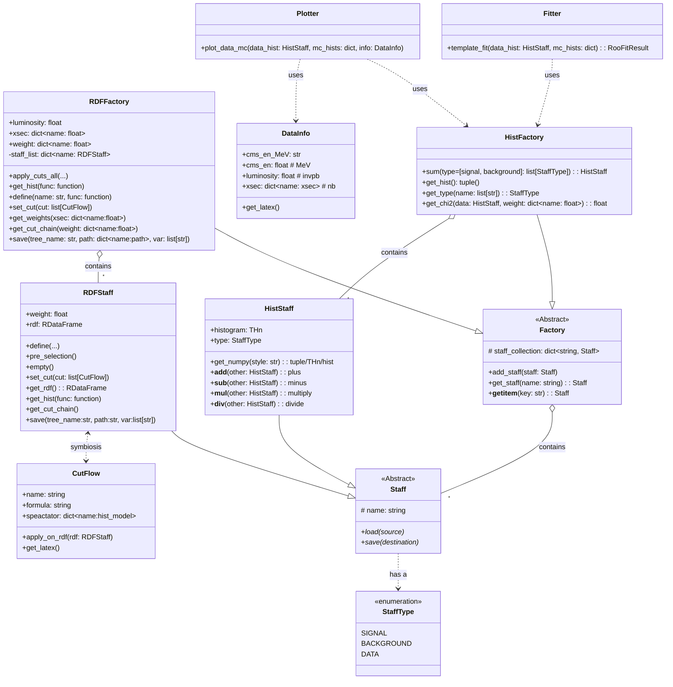

# datafactory: a simple framework handling baisc HEP data-MC analysis

本项目是一个 Python 工具集，针对一套数据和多个蒙卡样本的联合分析。
基于`ROOT::RDataFrame`提供事例筛选、一维-二维直方图统计分析和可视化相关的功能模块，
主要包括：

- 核心功能（core.py）：基础工具类与通用方法
- 统计分析（statistic.py）：数据统计与分析方法
- 直方图工具（hist.py）：统计分布与直方图绘制
- 绘图功能（plot.py）：通用数据可视化工具
- RDF 处理（rdf.py）：资源描述框架（RDF）数据解析或操作
- 样式配置（style.mplstyle）：Matplotlib 图表风格定制

MC 样本被描述为`RDF`和`Histogram`的字典，根据过程截面、数据亮度与数据对齐。

